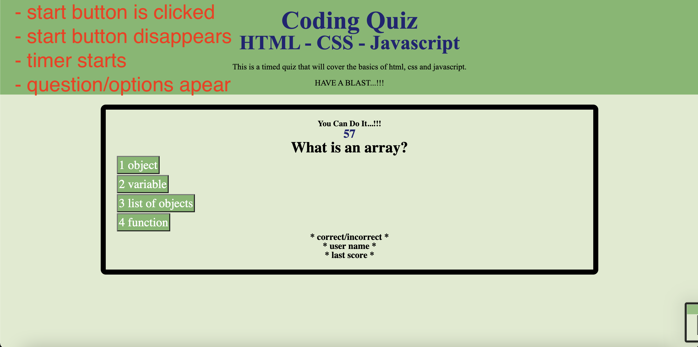

## Project Name : coding-quiz-html-css-js 
 
 

## Link to the working site
 

    - https://kasdjono.github.io/coding-quiz-html-css-js/
 

## This program will run a quiz about coding
 
 

## The following features have been added to the page:
 

        - When start button is clicked : quiz & timer begins
        - When a question is answered : another question will come up
        - If a question is answered incorrectly, 10 seconds will be removed from the time left 
        - The quiz ends when all questions have been answered or the timer reaches 0
        - Generates a randomly selected code within user specification
        - When the quiz is over, the user will enter their user name and the browser will save the name and score

 

## Screen Shots of Profile Page
 

        - The following pictures were taken before the proper questions were written

 
